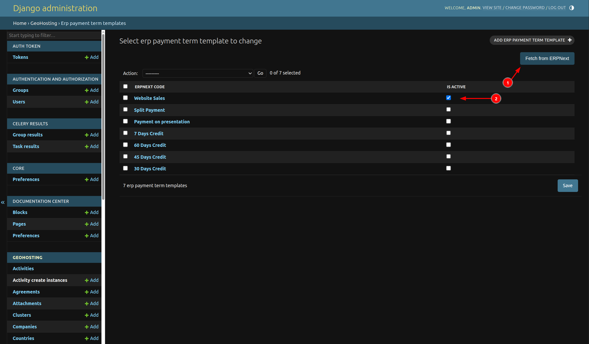
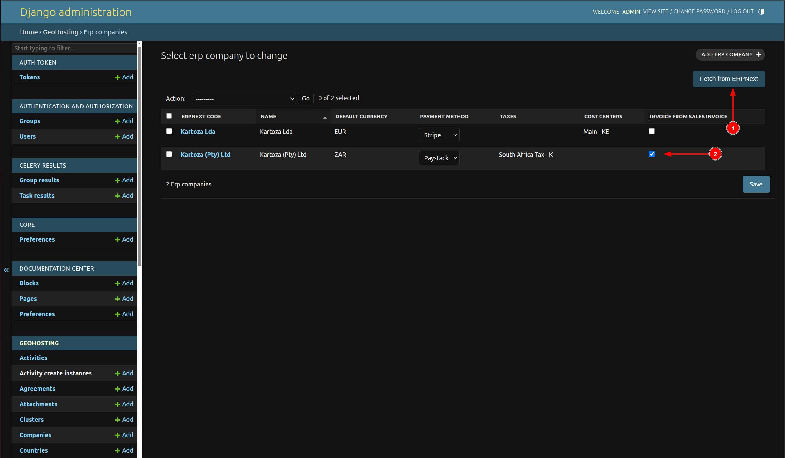
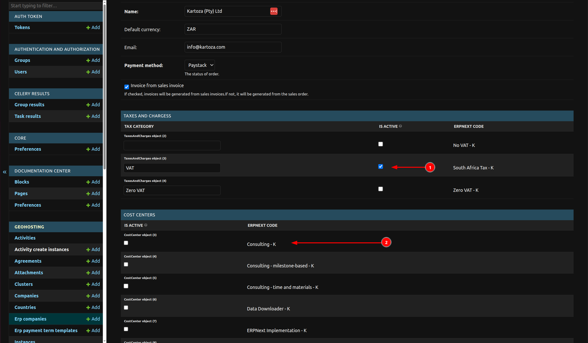

# Invoicing

This setup ensures that invoicing works as expected. It **must** be completed;
otherwise, the data pushed to ERPNext will be incorrect.

## 1. Set Up ERP Payment Term Template

The ERP payment term template defines the terms used for payments in sales
orders.
This setup is **required** for Kartoza Lda.

---

To set this up:

1. Go to `/admin/geohosting/erppaymenttermtemplate/`.
2. Click **"Fetch from ERPNext"** (1). This will fetch all payment terms from
   ERPNext.
3. Wait a moment, then refresh the page.

After refreshing, make sure to check the **"Is active"** column for the term
that will be used (2).
By default, it is **"Website Sales"**, since GeoHosting payments are processed
through another payment gateway.

---

## 2. Set Up ERP Company and Invoice Source

This setup is used to fetch ERP companies and define the source of the invoice.

### Steps:

1. Go to `/admin/geohosting/erpcompany/`.
2. Click **"Fetch from ERPNext"** (1). This will fetch all companies from
   ERPNext.
3. Wait a moment, then refresh the page.

After refreshing, review the **"Invoice from Sales Invoice"** option:

* If **checked**, the user will receive the invoice from a **Sales Invoice**.
* If **unchecked**, the user will receive the invoice from a **Sales Order**.

---

## 3. Set Up Taxes and Cost Center

This setup is used define the taxes and cost center of company.
While fetching company before, it will also fetching taxes and cost center.

Go to the detail page of company, and scroll to the bottom.
On the Taxes and chargess, checked "is_active" for the taxes that will be used.
On the Cost centers, checked "is_active" for the taxes that will be used on the
invoice.