# G3W Guide

## Using the Kartoza GeoSpatialHosting Dashboard

After your service has finished setting up, you will be redirected to the Hosted Services page of the GeoSpatial Hosting Dashboard. Here, you can view all your purchased services.

 

  
  

    Image credit: <a href="https://geohosting.sta.do.kartoza.com/" target="_blank">Kartoza GeoSpatialHosting</a>
  

 

**To access your login credentials:**

1. Click the Get Credentials button under your hosted service.

2. Your credentials will be copied to your clipboard.

     > **Hint:** Paste and save your credentials in a secure location.

3. Click the application name you selected for your GeoServer instance to open it.

       

     

       
       

       Image credit: <a href="https://geohosting.sta.do.kartoza.com/" target="_blank">Kartoza GeoSpatialHosting</a>
       

     

     
 

**To delete a hosted service:**

1. Click the 3 dots in the corner of the hosted service pane.

2. From the dropdown menu, select **Delete**.

 

> **⚠️ IMPORTANT** 
> 
> Deleting a hosted service is **permanent**. All associated data will be irreversibly removed with **no option for recovery**.

---

## Tutorial

### Overview

This tutorial is centered around a QGIS project designed to manage a layer representing a collection of buildings within a specific geographic area.

Beyond **spatial data**, the project also handles a wide range of **attribute information**, including maintenance records, using a 1:n relational structure to allow each building to be associated with multiple maintenance entries.

 

Throughout the tutorial, you will gain **practical skills** in:

1. **Customizing** the graphic and functional elements of the base QGIS project.
2. **Publishing** the project as a WebGIS service using G3W-SUITE.
3. **Creating** custom search tools for efficient data exploration.
4. **Integrating** interactive charts using the DataPlotly plugin.
5. **Enabling** online editing, including:

     - Custom form layouts
     - Specialized widgets for improved user interaction

 

> **Note:** This tutorial aims to demonstrate how a real-world GIS project can be fully managed through G3W-SUITE and QGIS.

---

### Data

#### Data Download

This tutorial is based on a predefined dataset and a QGIS 3.34.x LTR project from the official [G3W-SUITE](https://g3w-suite.readthedocs.io/en/latest/index.html) documentation website, which you can download using the link below:

- [Tutorial Data Download](https://drive.google.com/file/d/1WK_V1wYpvSfIAY3GCBL_hbW2TX6F7AZ8/view?usp=sharing)

 

> **Note:** The download link can also be found under the [Download Demo Data](https://g3w-suite.readthedocs.io/en/latest/demo.html#download-demo-data) section of the G3W-SUITE Documentation

---

#### Data Structure

The downloaded `.zip` file includes a G3W-SUITE directory containing the following **three subdirectories**:

 

📁 **`projects/`**

   - Contains the QGIS project file: `public-buildings-management-demo-39.qgs`
   - The project is fully optimized for this tutorial.

    

📁 **`plots/`**

   - Contains plot definitions created using the DataPlotly plugin, saved in `.xml` format.

    

📁 **`project_data/spatialite/`**

   - Contains the SpatiaLite database: `build_management_demo.sqlite`
   - This database stores the core data used in the project.

    

Inside the **`build_management_demo.sqlite`** file, you’ll find the following layers:

 

   | Layer Name          | Type    | Description                                                      |
   | ------------------- | ------- | ---------------------------------------------------------------- |
   | `buildings`         | Polygon | Main reference layer for editing building features               |
   | `maintenance_works` | Table   | Records of maintenance activities linked to individual buildings |
   | `buildings_rating`  | Table   | Annual ratings or assessments of buildings                       |
   | `roads`             | Line    | Road network used to assign addresses to buildings               |
   | `work_areas`        | Polygon | Work zone boundaries used to define geo-constraints              |
   | `type_subtype`      | Table   | Lookup table for building type and subtype values                |

 

> **Note:** A master copy of this dataset is hosted on the server. You cannot modify your local copy and expect those changes to reflect on the server.

 

The QGIS project (based on QGIS 3.34.x LTR) is pre-configured with the following **features**:

1. **Categorized symbology** for the:

     - `buildings` layer based on the `type` field.

      

2. **1:n relationships defined between:**

     - `buildings` ↔ `maintenance_works`
     - `buildings` ↔ `buildings_rating`

      

3. **Pre-built query forms for:**

     - `buildings` layer
     - `maintenance_works` table

      

4. **Predefined editing widgets for:**

     - `buildings`, `maintenance_works`, and `buildings_rating` attributes

      

5. **Four print layouts:**

     - Two standard layout templates
     - Two atlas layout templates using features from the buildings layer

---

#### Data Preperation

Before publishing your QGIS project to the WebGIS platform, you **must update the project title**, as it will serve as the unique identifier for the published WebGIS service.

> **Note:** The publication system uses the project title as the WebGIS service ID. If not updated, your service may be misidentified or conflict with others.

 

**Steps to Update the Project Title:**

1. Open your QGIS project.

2. Go to the **Project** menu.

3. Select **Properties...**

4. Under the **General tab**, locate the **Project Title** field.

5. Enter a unique and descriptive title for your project.

6. Click **OK** to apply the changes.

      

     **Make sure the title:**

       - Reflects the content or purpose of your project.
       - Does not contain special characters or excessive spacing.
       - Is short but specific enough to identify the service in the WebGIS environment.

---

## Access the online service

To publish the project, you can access the G3W-SUITE test application via the following URL: [URL](https://v39.g3wsuite.it)

To access the Administration Panel it is necessary to log in using the following credentials:

user: `demo`

password: `G3wsuite123`

In case of login fails, report the problem to info@gis3w.it

## Publish the QGIS project as a WebGis service

After authentication it will be possible to access the `Administration session` and view the Dashboard.

In the Dashboard there will be the menu for access to the Cartographic Groups pertaining to your user and the menus relating to additional modules not active in this demo.

Click on the `Show` item in the ligth blue Groups box to acces at the list of available Cartographic Groups.

Access the list of webgis in the Cartographic Group `Demo Group` clicking on the project number shown.

Now click on the button 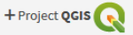 to publish your QGIS project.

Fill out the form defining the various aspects to be associated with the WebGis service being published:

## QGIS project

* **QGIS file:** load the QGIS cartographic project to be published (.qgz or .qgs file)

## ACL Users

### Management of access permissions

* **Viewers users:** define the individual users (`Viewers`) who have the credentials to view the WebGis service. By choosing the anonymous user (`AnonymusUser`) the group will be freely accessible.

* **Viewer user groups:** you define the user groups (`Viewer`) which have the credentials to view the content of the service.

## Default base layer

* In this session you define which base layer should be active at startup.

* The choice is limited to the list of base layers activated for the cartographic group in which you work.

* It is also possible not to define any active base layer at startup.

## Description data

* **Public title:** Title to be associated with the project and displayed on the client header. If left blank, the title associated with the QGIS project will be used or, in the absence of this, the name of the project file

* **Description:** Description of the project, it will appear at the public portal level.

* **Thumbnail (Logo):** logo to associate with the project. This image will be viewable in the list of projects within the cartographic group

* **URL alias:** a human readable URL for the map

> Note: contents marked with * are mandatory.

## Options and actions

Choose your preferred options regarding the following options:

* **User QGIS project map start extent as webgis init extent:** check this control if you want set initial extent from QGSI project initial extent, `Project properties -> QGIS Server -> WMS capabilities` (Advertised extent)

* **Tab's TOC active as default:** set tab’s TOC (Layers, Base layers, Legend) open by default on startup of webgis service

* **Legend position rendering:** this option allows to set legend rendering position:

* **In a separate TAB:** default value, the legend is rendered into a separate tab

* **Into TOC layers:** the legend is rendered inside layers toc

* **Automatic zoom to query result features:** if in the results of a search there are only features of a layer, the webgis automatic zoom on their extension

  [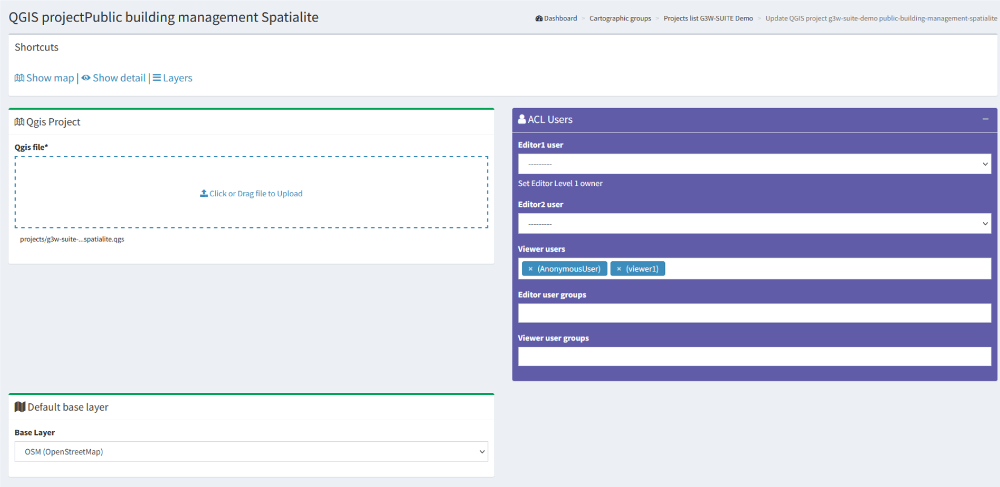](./img/g3w-guide-img-8.png)
  
  
  After filling in the various form, click on the `Save button` at the bottom to confirm your choices.

**If the publication was successful, the QGIS project will appear in the list of projects in the Cartographic Group.**

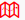 Clicking on the **`View map`** icon will access the WebGis service in consultation.

# Update the published WebGis service

If you want to modify some graphic-functional aspects of your WebGis service, modify your QGIS project and update the WebGis service by clicking on the **`Modify`** icon ✏️.

Reupload the QGIS project with your changes, click on the **Save button** and see the resuts on the cartographic client.

# Activation of additional functions

Once your project has been published, you can access the list of widgets and additional functions to enrich your WebGis service.

## Widget management
Thougth the **`Layers list` icon** 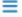 it is possible to access the list of the geographical states that compose it and define some functional aspects that will be enabled at the cartographic client level.

The new session will show you the **list of the layer** present in the published QGIS project

 * **Label:** layer alias applied at the QGIS project level
   * The blue eye icon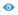 allows you to know the ID associated with the layer at the project level, this ID will be useful for creating parameterized URLs
 * **Name:** name of the layer (file or DB table)
 * **Type:** illustrates the type of data (WMS, PostGis, SpatiaLite, GDAL / OGR ...)
 * **WMS external:** to speed up loading, the WMS layers present in a QGIS project are managed directly by Django and not by QGIS-Server.
     * In case of non-external WMS, the service is managed by Django and this eliminates cross-domain problems but the only managed GetFeatureInfo response type is GML.
     * The external WMS option allows obtaining a response to the query (GetFeatureInfo) even if the response is not in GML but also in HTML or text/plain format.
     * The option is available only if the WMS loaded on the QGIS project is associated with the same projection system as the project.
 * **WFS:** a check mark shows whether the layer is published as a WFS service or not
 * **Actions:** a series of icons dedicated to various functions
   *  **Caching Layer:** allows you to activate and manage the cache of the single layer at the project level
   *  **Editing layer:** shows if the online editing function is active on the layer and allows you to activate and define it
   *  **Hide layer by user/groups:** hide specific layers from the TOC based on specific users or groups of users
   * 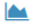 **QPlotly widget:** add or manage plots created with DataPlotly QGIS plugin
   *  **Geo-constraints by user/group:** create or manage editing and visualization geo-constraints based on poligonal layers
   *  **Alphanumeric and QGIS expressions constraints by user/groups:** create or manage editing and visualization constraints based on SLQ language or QGIS expressions
   * 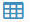 **Hide columns by User/Groups:** create or manage constraints on one or more fields of a layer based on single or group user/s
   * 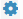 **Widgets list:** shows how many widgets (eg searches) are associated with this layer and allows you to activate new ones
   *  **Manage layer styles:** manage multi-style layer
 * **Download capabilities:** allows the download of the geographic and not geographic layers in various formats
   * **Download as shp/geotiff:** for vector and raster layers
   * **Download as GPK:** for geographic or not geographic layers
   * **Download as xls:** for all types of layers, in .xls format
   * **Download as csv:** for all types of layers, in .csv format
   * **Download as gpx:** for geographic layers, in .gpx format
   * **Download as PDF:** for all types of layers, in .pdf format (limited to the attributes associated with individual features)
 * **Visibility capabilities:** allows you to define some elements in a generic way, i.e. without distinction between users.
   * **Hide attributes table:** make the attribute table unsearchable
   * **Hide legend:** do not show the associated legend
   * **Hide Layer TOC:** hide the layer in the TOC

The number above each Action icon shows if and how many related objects are present.

**Try to activate the available options and test the result on the WebGis**

## Search widget creation

To create a search tool available at WebGis level, **choose the vector layer** on which to apply the tool and **click on the `Widget list icon` ** 

**NB:** there may be a number of searches created by other users for the same layer.

You can activate them by **clicking on the `Linked` chekbox**.

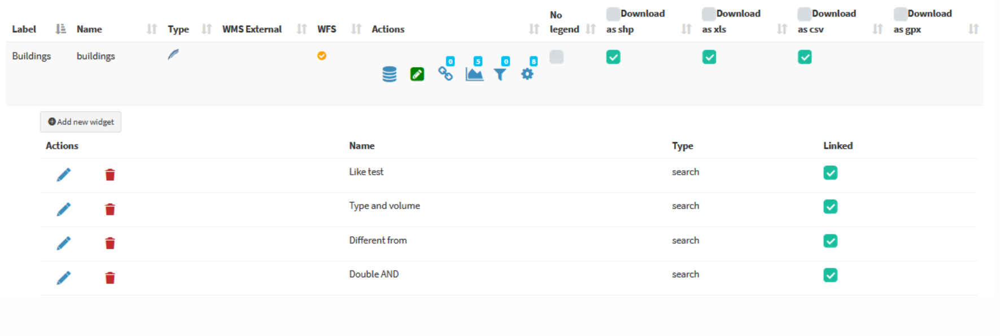

The listed searches can be **modified, deleted or unlinked** using the appropriate icons.

To **create a new search**, click on the blue link **`New widget`**.

In the related form we can define:
* **Form Title**
  * **`Type`:** "Search"
  * **`Name`:** name that G3W-SUITE will use to internally register the search widget.
* **General configuration of research and results**
  * **`Search title`:** title that will become available in the **'Research'** panel of the WebGis interface
* **Search fields settings**
  * **`Field`:** field on which to carry out the research
  * **`Widget`:** method of entering the value to be searched
            `InputBox`: manual compilation
            `SelectBox`: values ​​shown via drop-down menu
            `AutoCompleteBox`: values ​​shown through auto-complete mode
  * **`Alias`:** alias assigned to the field that will appear in the search form
  * **`Description`:** description assigned to the field
  * **`Comparison operator`:** comparison operator (**=, <,>,> <,> =, <=, LIKE, ILIKE**) through which the search query will be carried out. The LIKE and ILIKE operators will only be available for PostGis or SpatiaLite layers
  * **`Dependency`:** this parameter (optional) allows, only in the case of SelectBox widgets, to list the list of values ​​of a field filtered according to the value defined for the previous fields. The tool allows, for example, to display, in the drop-down menu dedicated to the choice of cadastral particles, only the particles connected to the sheet chosen in the previous option. This function is only available for PostGis or SpatiaLite layers.

Now it is possible to **define the dependence more or less strong** (strictly).

In case of **strictly dependence**, the values of the dependent fields will be loaded **only after** the choice of the value of the field on which the dependency depends.

Otherwise it will be possible to define the values of the individual fields freely and **without a specific order**. The values available for the other fields will in any case depend on the choice made.

The button  allows you to add additional fields for the construction of the search query currently manageable through **AND/OR operators**.

The example below shows the compilation of the form for creating a search widget dedicated to a cadastral cartography layer.

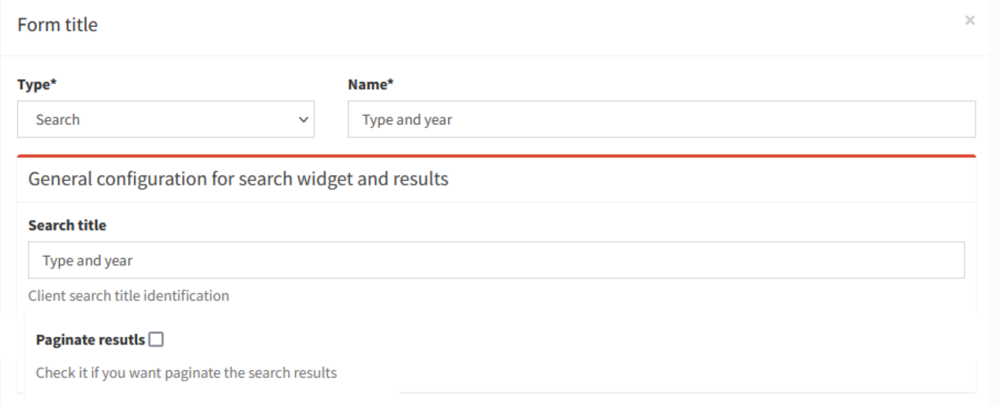

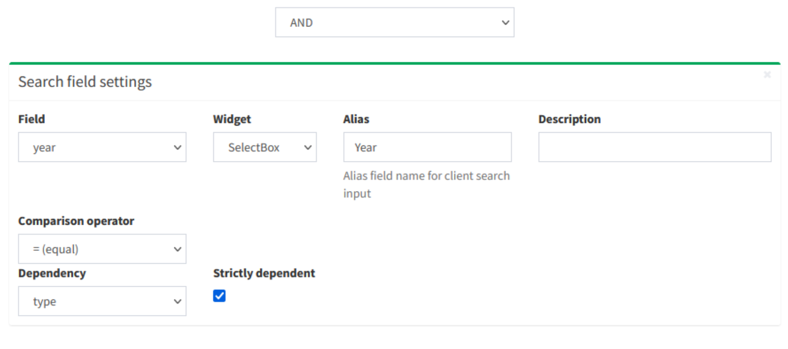

Once the form has been filled in, click on the **`OK button` to save** the settings.

Once the settings are saved, the created widget will appear in the list of Widgets associated with the layer.

**The widget will already be **`linked`** and therefore available in the WebGis interface on the left panel.**

## Plots widget

**Add plots created using QGIS [DataPlotly](https://github.com/ghtmtt/DataPlotly) (a great plugin developed by [Matteo Ghetta](https://github.com/ghtmtt)) in the cartographic client.**

The module, based on the [Plotly library](https://plotly.com/), manages **plots saved as xml**.

The plots are connected to the layers defined on the QGIS project, in this way, as for the searches and the constraints, it is possible to activate the same plots on all WebGis services in which the reference layer is present.

For this reason, there may be some plots created by other users for the same layer.
You can activate them by **clicking on the `Linked` chekbox**.

The title of the chart, defined at the plugin level, will be the unique identifier.

Try to create your plots in the QGIS project, save them as .xml and upload them to view the resluts on the webgis.

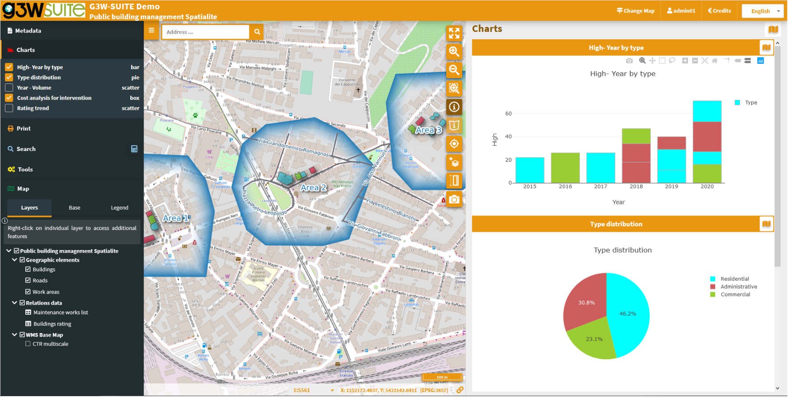

The graphs are filterable based on the:
*  features visible on the map
*  filter based on the selected features
 
These **filters** are also **reflected on the plots associated to the related data** (in 1:N mode) based on the visible and/or selected parent features.

The **filter based on the map content** can be activated globally on all plots (icon at the top of the panel dedicated to charts) or on only some specific plots (icon placed at the level of the individual plots).

The plots will automatically update after pan and zoom operations on the map

If activated, the **filter based on the selected features** is automatically activated on all related plots (associated with the same layer and with the 1:N relationed tables)

Appropriate **messages** at the single plots level will indicate the activation of these filters.

If 1: N relations are associated with the interrogated layer and plots have been activated on the referencing tables, it will also be possible to consult these plots by querying the referenced layer and clicking on the **Show relation charts** icon present in the results form.

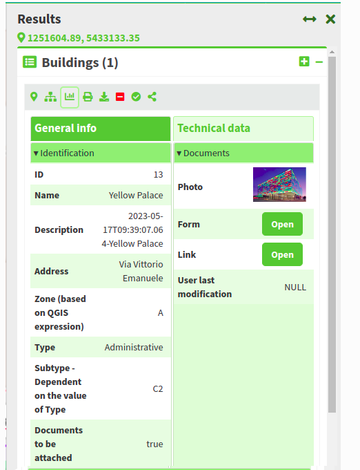
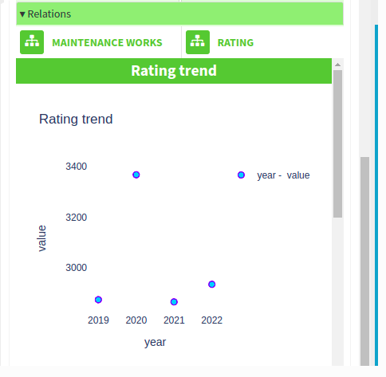

**Show relation charts:** display of graphs related to 1: N related data. Only if 1: N relations are associated with the interrogated layer and graphics have been activated on the boy tables.

# Editing on line
_**Forms and editing widgets are already defined on the project associated with the tutorial for the geometric layer of buildings and for the alphanumeric table related interventions_maintenance.**_

* **`Buildings`**
  * **id** (integer - primary key): autogenerate
  * **name** (text NOT NULL): text edit
  * **address** (text): Value relation (roads layer - code/name fileds)
  * **zone** (text): text edit (with default values based on a QGIS expression to for association with the intersecting works area)
  * **type** (text NOT NULL): unique values (Administrative, Commercial, Residential)
  * **subtype** (text NOT NULL): value relation with multiple selections (based on type_subtype table for a drill-down cascading forms)
  * **attachment** (integer): check box 1/0 (the visibility of the conditional form Documents is based on this field)
  * **photo** (text): attachment
  * **link** (text): text edit
  * **form** (text): attachment
  * **user** (text): text edit (automatically filled in with the G3W-SUITE  username creator of the feature)
  * **year** (integer NOT NULL): unique values (2015,2016,2017,2018,2019,2020)
  * **high** (integer NOT NULL): range (10-30 step 2)
  * **volume** (integer): range (50-200 step 10)
  * **surface** (integer): text edit
  * **architectural_barriers** (text): Checkbox (Checked - Not checked)
  * **date_barriers** (date): date (yyyy/MM/dd)
  * **safety_exits** (text): checkbox (Checked - Not checked)
  * **date_exits** (date): date (yyyy/MM/dd)
  * **fire_system** (text): Checkbox (Checked - Not checked)
  * **date_fire** (date): date (yyyy/MM/dd)

* **`Maintenance_works`**
  * **id** (integer - primary key): autogenerate
  * **id_buildings** (text - relation key): text edit
  * **maintenance** (text NOT NULL): unique values
  * **date** (date): date (yyyy/MM/dd)
  * **form** (text): attachment
  * **value** (integer): range (10-30 step 2)
  * **outcome** (text): unique values (good, medium, bad)
  * **responsible** (text): text edit
  * **cost** (integer): range (1000-5000 step 1)
  * **validation** (boolean): checkbox (0/1)
   
* **`Buildings rating`**
  * **id** (integer - primary key): autogenerate
  * **id_buildings** (text - relation key): text edit
  * **date** (date): date (yyyy/MM/dd)
  * **value** (integer): range (1000-4000 step 500)
  * **year** (integer): range (2018-2022 step 1)

To activate the editing function on webgis, access the list of layers and identify the three layers shown above.

Clicking on the icon **Editing layer**  (placed at the left of each rows) will open a modal window that will allow you to:
* define the **`editing activation scale`** (only for geometric tables)
* define the **`Viewer users`** (individuals or groups) **`enabled`** for online editing

With regard to the last aspect, it should be noted that **Viewers users** (individuals or groups) **available** in the drop-down menu **will be limited to those who have allowed access in consultation to the WebGis project**

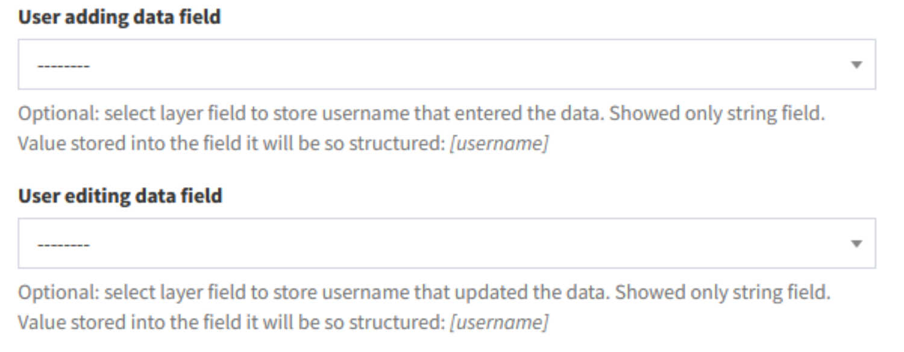

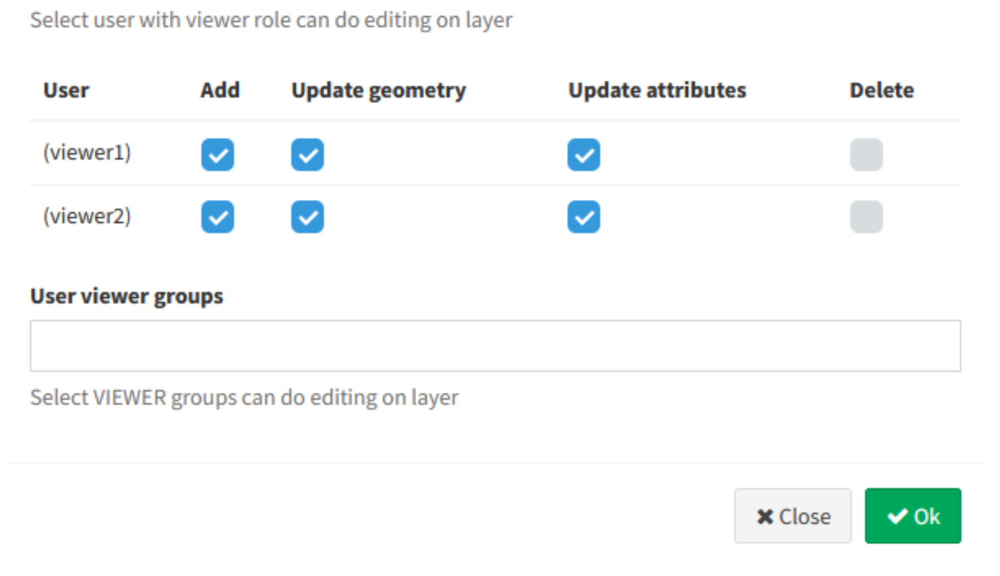

Once the editing function is activated, updating the service, the **`Tools menu` will appear on the left panel.**

**By activating the editing function it will be possible to edit the geometries and attributes of the Public Buildings layer and the related interventions.**

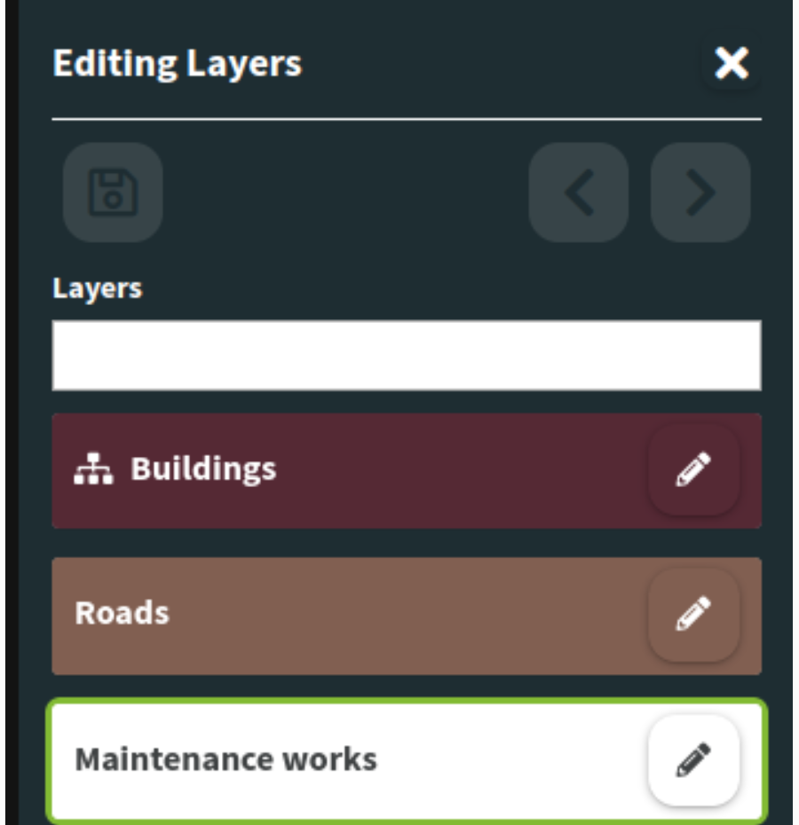

For **further information** on the web editing function, read the [**dedicated chapter on the manual**](https://g3w-suite.readthedocs.io/en/v3.9.x/g3wsuite_editing.html#online-editing-tools-at-cartographic-client-level)

# Personalize your demo

**Do you want to test the online editing function more deeply?**

Redefine attribute forms, aliases and editing widgets associated with the individual fields and reload the project to check the new settings.

**It is advisable to consult the** [paragraph dedicated](https://g3w-suite.readthedocs.io/en/v3.9.x/g3wsuite_editing.html#activation-and-configuration) **to the list and limitations of the individual editing widgets inheritable from the QGIS project.**
