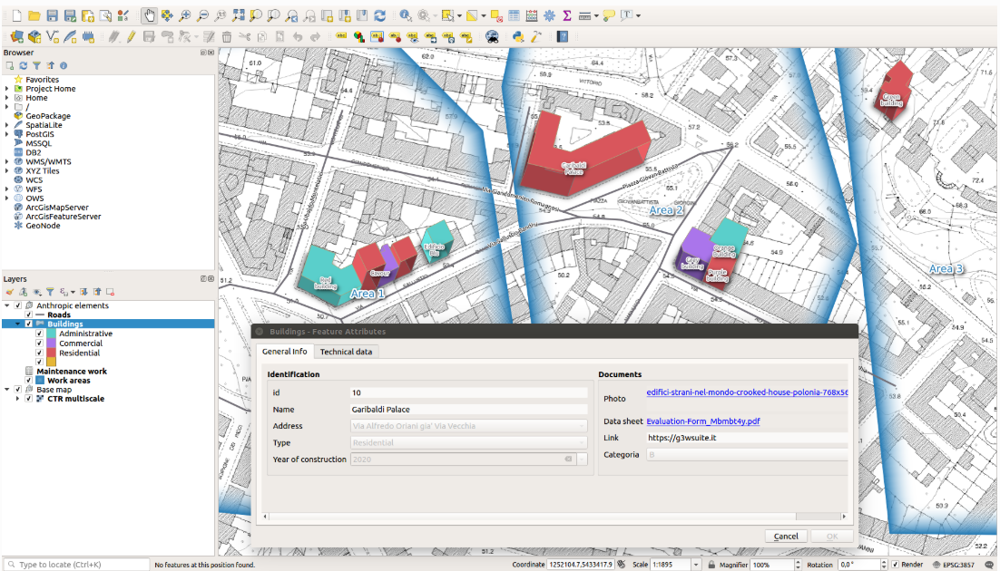

# Introduction

G3W-SUITE is a modular client-server application for the management and publication of interactive map projects. The framework was born from the need to have a software capable of publishing, in total autonomy and in a simple and fast way on a webgis client, cartographic projects realized with [QGIS](https://qgis.org/).

The current release (3.9) is compatible with `QGIS 3.34.x LTR` (Server and Desktop).

[](./img/g3w-img-1.png)

[](./img/g3w-img-2.png)

## Version

At the moment it’s not used a classic versioning system for the suite, this branches are available.

| Branch | Python version | Django version | QGIS  | QGIS API | Status                  |
|--------|---------------|---------------|------|----------|-------------------------|
| dev    | 3.12          | 4.2           | 3.34 | Used     | Continuous development  |
| v3.9   | 3.12          | 4.2           | 3.34 | Used     | Bug fixing              |
| v3.8   | 3.10          | 3.2           | 3.34 | Used     | Bug fixing              |
| v3.7   | 3.10          | 3.2           | 3.28 | Used     | No longer supported     |
| v3.6   | 3.10          | 3.2           | 3.22 | Used     | No longer supported     |
| v3.5   | 3.10          | 2.2           | 3.22 | Used     | No longer supported     |
| v3.4   | 3.8           | 2.2           | 3.22 | Used     | No longer supported     |
| v3.3   | 3.6           | 2.2           | 3.16 | Used     | No longer supported     |
| v3.2   | 3.6           | 2.2           | 3.16 | Used     | No longer supported     |
| v3.1   | 3.6           | 2.2           | 3.10 | Used     | No longer supported     |
| v3.0   | 3.6           | 2.2           | 3.10 | Used     | No longer supported     |

---

# Raw installation

The following instructions are for Ubuntu 24.04 LTS (Noble) with Python 3.12.3.
This installation is useful for development but no for production deploy. 

## Install required packages
First step is install dev libraries packages for python module

```bash
sudo apt-get install -y \
    libxml2-dev \
    libxslt1-dev \
    libgdal-dev \
    python3-dev
```

If you are running a ubuntu Server version is necessary to install also a XServer for the Qt libraries. 
Is possible install `XVFB` a virtual framebuffer X server for X Version 11 and run it.

```bash
sudo apt install -y xvfb

sudo Xvfb :99 -screen 0 640x480x24 -nolisten tcp &
export DISPLAY=:99
```
I suggest you to create a systemd service to run it on bootstrap.


## Install QGIS Server

```sh
sudo curl -sS https://download.qgis.org/downloads/qgis-archive-keyring.gpg > /etc/apt/keyrings/qgis-archive-keyring.gpg && \
sudo echo "deb [signed-by=/etc/apt/keyrings/qgis-archive-keyring.gpg] https://qgis.org/ubuntu-ltr noble main" | \
sudo tee /etc/apt/sources.list.d/qgis.list && \
sudo apt-get update && apt-get install -y python3-qgis qgis-server
```

## Installation of node.js and Yarn
G3W-ADMIN use javacript package manager [**Yarn**](https://yarnpkg.com/) and [**Node.js**](https://nodejs.org/it/)

```bash
sudo curl -sS https://dl.yarnpkg.com/debian/pubkey.gpg | sudo apt-key add - && \
sudo echo "deb https://dl.yarnpkg.com/debian/ stable main" | \
sudo tee /etc/apt/sources.list.d/yarn.list && \
sudo apt-get update && apt install -y yarn && apt-get clean
```
## Create virtualenv

Install the follow python package
[**Virtualenv**](https://virtualenv.pypa.io/en/stable/)
[*Virtualenvwrapper*](https://bitbucket.org/virtualenvwrapper/virtualenvwrapper/src/master/)

The following instructions are for python 3.12

Install python pip and virtualenvwrapper

```bash
sudo apt-get install python3-pip && sudo pip3 install virtualenvwrapper --break-system-packages
```

Create a directory where to create environments for your virtualenvs.
```bash
mkdir <path_to_virtualenvs_directory>
```

To activate virtuenvwrapper on system login, add follow lines to 'bashrc' config file of your user
```bash
nano ~/.bashrc
....
export WORKON_HOME=<path_to_virtualenvs_directory>
export VIRTUALENVWRAPPER_PYTHON=/usr/bin/python3
source /usr/local/bin/virtualenvwrapper.sh
```
Login again with your user to activate `Virtualenvwrapper`

```bash
sudo su <my_ubuntu_username>
```

## Virtualenv creation
To create a virtualnenv is sufficient call mkvirtualenv follow by the identification name for virtualenv (to use QGIS API into a virtualenv only solution is to give access python system site-packages to it using *--system-site-packages* option)
```bash
mkvirtualenv --system-site-packages g3wsuite
```

This last command just make active your new virtualenv environment, for the next times is possible use the follow command to activate the virtualenv environment:

```bash
workon g3wsuite
```

### Use of native `venv` Python3
For G3W-SUITE deploy clearly can be used the native Python3 `venv` module, `virtualenvwrapper` is a third part module that render the use and management of virtual environments very simple.

## Install G3W-SUITE

### Clone code from github
```bash
git clone https://github.com/g3w-suite/g3w-admin.git
```

### Set local_config.py file
G3W-ADMIN is a Django application, and to work is necessary set a config.py file. To start copy local_settings.example.py and set the databse and other:
```bash
cd g3w-admin/g3w-admin/base/settings
cp local_settings_example.py local_settings.py
```

set database connection parameters (DATABASES), media root (MEDIA_ROOT) and session cookies name (SESSION_COOKIE_NAME):

```python
...

DATABASES = {
    'default': {
        'ENGINE': 'django.contrib.gis.db.backends.postgis',
        'NAME': '<db_name>',
        'USER': '<db_user>',
        'PASSWORD': '<db_user_password>',
        'HOST': '<db_host>',
        'PORT': '<db_port>',
    }
}

...

DATASOURCE_PATH = '<static_path_to_gis_data_source>'

...

MEDIA_ROOT = '<path_to_media_root>'

...

SESSION_COOKIE_NAME = '<unique_session_id>'
```

!!IMPORTANT!! Make sure that paths set for DATASOURCE_PATH and MEDIA_ROOT exist.

### With paver commands

G3W-ADMIN has a series of [paver](http://pythonhosted.org/Paver/) CLI commands to administrate the suite.
After prepared environment if sufficient invoke paver *install* task

#### Install paver
```bash
pip3 install paver 
```
#### Install G3W-SUITE
```bash
paver install
```

### Run G3W-SUITE

#### By Django
```shell
cd g3w-admin/g3w-admin
python3 manage.py runserver 0.0.0.0:8000
```

#### To run the application with paver (EXPERIMENTAL)

```bash
paver start
```

and for stop
```bash
paver stop
```


G3W-ADMIN is a django application so is possible run app by standard django manage.py commands

```bash
./manage.py runserver
```

## Deploy G3W-SUITE

As other Django application, G3W-SUITE can be deployed by its wsgi capabilities.
On the web if simple to find tutorial for deploy a Django application.

The simpler way is to use [Apache2](https://httpd.apache.org/) as server WEB and its [mod_wsgi](https://en.wikipedia.org/wiki/Mod_wsgi) module.

Alternative solutions are:


* [Apache2](https://httpd.apache.org/) + [mod_proxy](https://httpd.apache.org/docs/2.4/mod/mod_proxy.html) + [Uwsgi](https://uwsgi-docs.readthedocs.io/en/latest/)
* [Apache2](https://httpd.apache.org/) + [mod_proxy](https://httpd.apache.org/docs/2.4/mod/mod_proxy.html) + [Gunicorn](http://gunicorn.org/)
* [Nginx](https://nginx.org/) + [Uwsgi](https://uwsgi-docs.readthedocs.io/en/latest/)
* [Nginx](https://nginx.org/) + [Gunicorn](http://gunicorn.org/)


## Manual installation steps

The preferred installation is by using the `paver` script as mentioned above, but in case you need to customize the installation process, here are the build and setup steps:

### Build static js code


```bash
# Install yarn (requires root):
curl -sS https://dl.yarnpkg.com/debian/pubkey.gpg | apt-key add -
echo "deb https://dl.yarnpkg.com/debian/ stable main" | \
    tee /etc/apt/sources.list.d/yarn.list
apt-get update && sudo apt install -y yarn
# Back to unprivileged user, from the repository directory, run:
yarn --ignore-engines --ignore-scripts --prod
nodejs -e "try { require('fs').symlinkSync(require('path').resolve('node_modules/@bower_components'), 'g3w-admin/core/static/bower_components', 'junction') } catch (e) { }"
```

Make sure build components are available in static and collected later
```
cd g3w-admin/core/static
ln -s "../../../node_modules/@bower_components" bower_components
```

### Install requirements

Possibly within a virtual env:

```bash
pip install -r requirements.txt
pip install -r requirements_huey.txt
```

### Django setup

```bash
python manage.py collectstatic --noinput
python manage.py migrate --noinput
```

Install some fixtures for EPSG and other suite options:

```bash
for FIXTURE in 'BaseLayer.json' 'G3WGeneralDataSuite.json' 'G3WMapControls.json' 'G3WSpatialRefSys.json'; do
    python manage.py loaddata  core/fixtures/${FIXTURE}
done
```

Sync menu tree items (re-run this command in case you installed optional modules and they are not visible in the admin menu tree):

```bash
python manage.py sitetree_resync_apps
```

## Continuous integration testing

CI tests are automatically run on GitHub by custom actions.

The Docker compose configuration used in the CI tests is available at [docker-compose.latest.yml](https://github.com/g3w-suite/g3w-admin/blob/dev/docker-compose.latest.yml).

The testing image is built from the dependency image and it will run all install and build steps from the local repository.

The dependency image is built from the [Dockerfile.deps](https://github.com/g3w-suite/g3w-admin/blob/dev/ci_scripts/Dockerfile.deps).

G3W-SUITE supports the latest LTR QGIS version, so at now is the 3.22, therefore there are also dockerfiles and docker compose files for this version:

* [docker-composer.322.yml](https://github.com/g3w-suite/g3w-admin/blob/dev/docker-compose.322.yml)
* [Dockerfile.32..deps](https://github.com/g3w-suite/g3w-admin/blob/dev/ci_scripts/Dockerfile.322.deps)
