# GeoNode Quick Start Guide

GeoNode is a platform for managing and sharing geospatial data — including datasets, maps, documents, and dashboards — with built-in tools for collaboration and publishing.

---

## Getting Started

### Create an Account

1. Visit the homepage and click **Register**.

2. Fill in your username, email, and password.
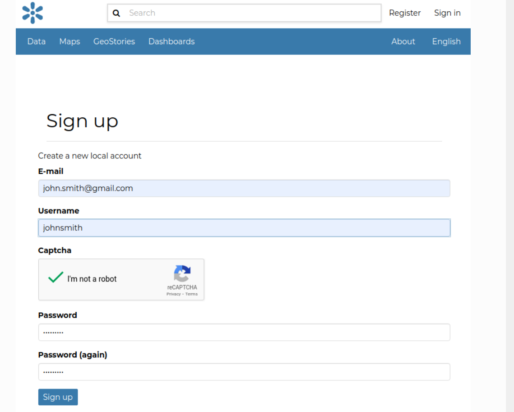  
3. Check your email and confirm your registration.

---

### Set Up Your Profile

1. Click your profile icon (top-right) → **Profile**.
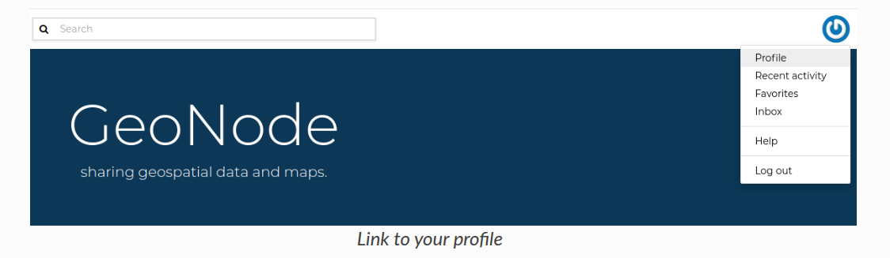  

2. Click **Edit Profile** to add:
   - Name
   - Organization
   - Contact info
   - Profile picture

  
  
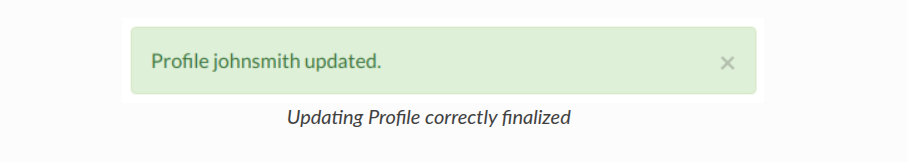

---

## Uploading Data

### Upload a Dataset

1. Go to **All Resources** → **Add Resource** → **Upload Dataset**.

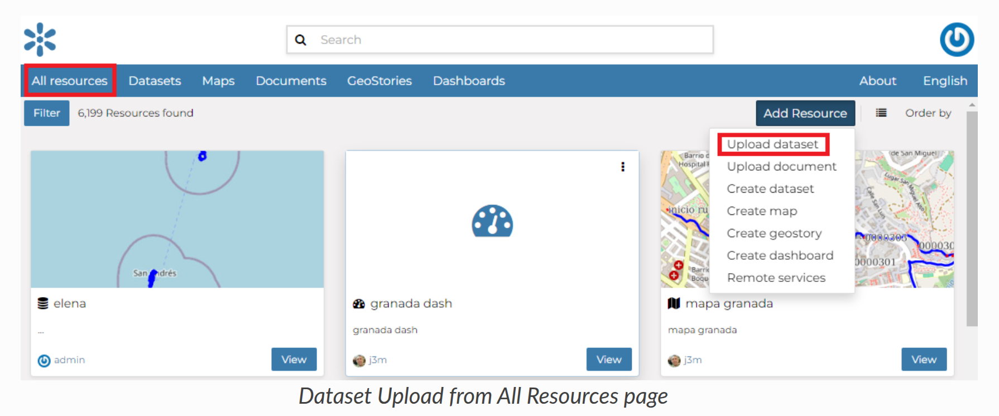  

2. Select vector (e.g., `.shp`, `.kml`) or raster (e.g., `.tif`) files.
3. Click **Upload**, then **View**.

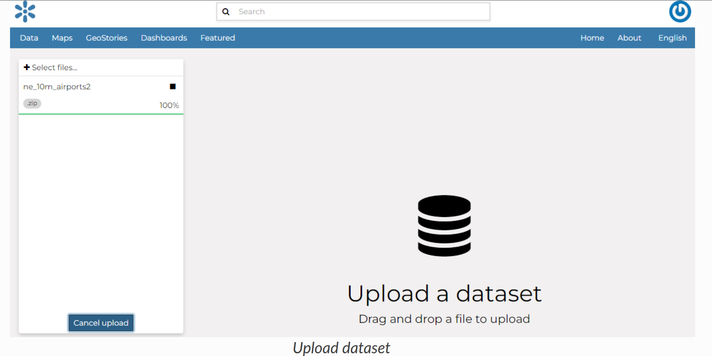  
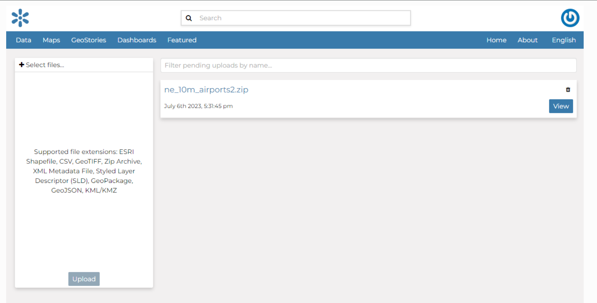

---

### Upload a Document

1. Go to **Documents** → **New** or **All Resources** → **Add Resource** → **Upload Document**.

  
  

2. Choose between uploading:
   - From your **Local File**  
     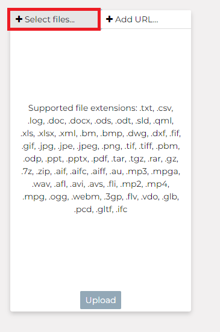
   - As an **External URL**  
     

---

## Creating a Map

1. Go to **Maps** → **New**, or use **Add Resource** → **Create Map**.
2. Optionally create a map directly from a dataset.

  
  
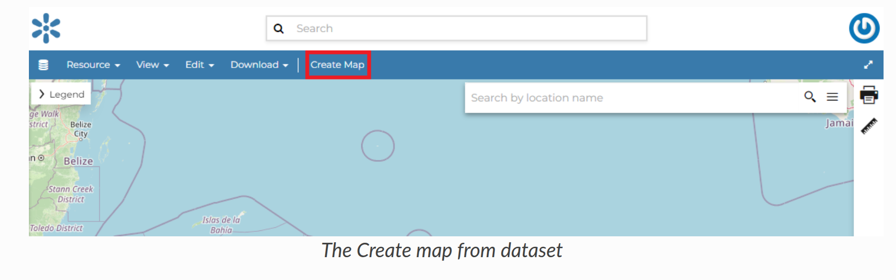

---

## Sharing & Permissions

1. Go to the resource (dataset, map, or document).
2. Click **Share** → set permissions for:
   - None
   - View Metadata
   - View and Download
   - Edit
   - Manage

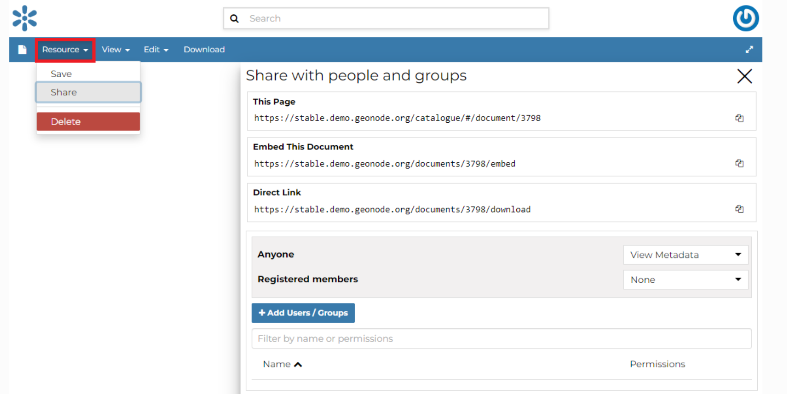  
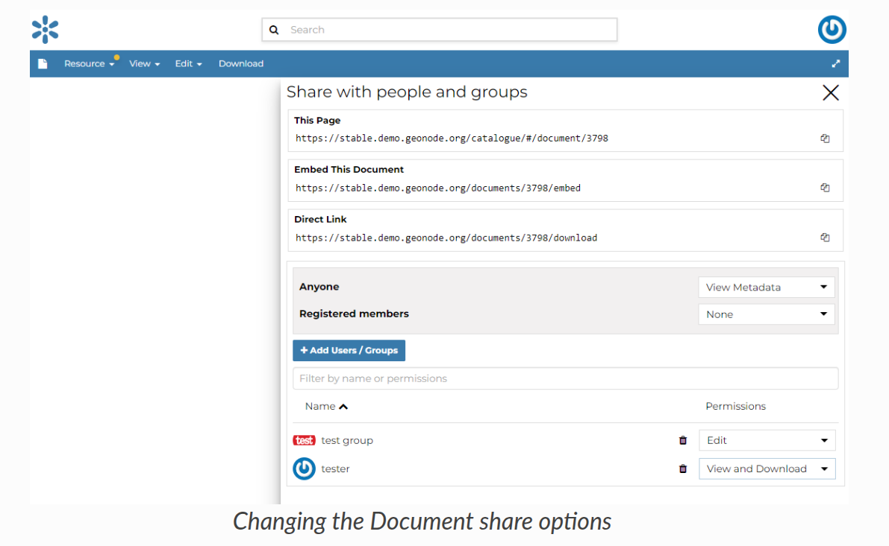

Click **Save** to apply changes.

---

## Finding Data

Use the **Search bar** or filter panel to find resources by:

- Keyword
- Type
- Category
- Owner
- Date
- Extent

  
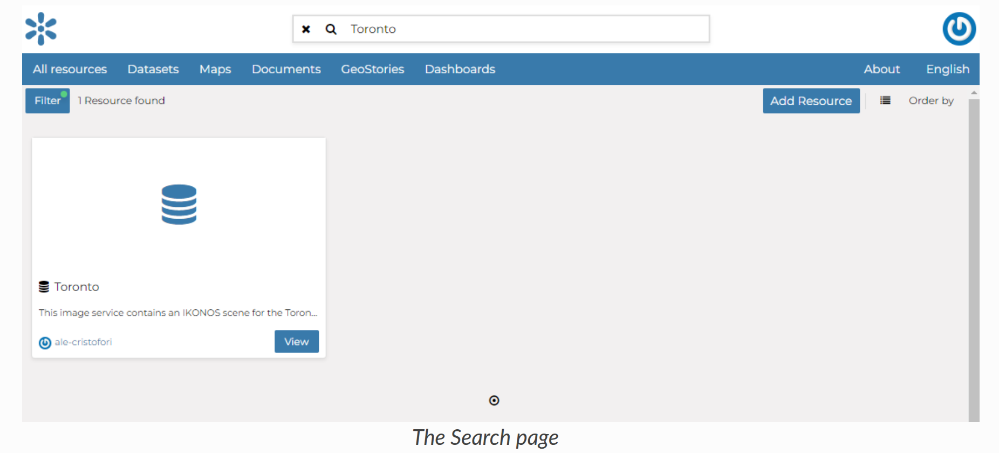  
  

---

## Other Useful Features

- **GeoStories**  
  Create immersive narratives with text, maps, videos, and images.

- **Dashboards**  
  Build analytical views using maps, charts, and counters.

---

## Need More Help?

Visit the official GeoNode documentation:  
**[https://docs.geonode.org/en/master/](https://docs.geonode.org/en/master/)**

---

© 2024 Kartoza. Licensed under the GNU AGPL v3.