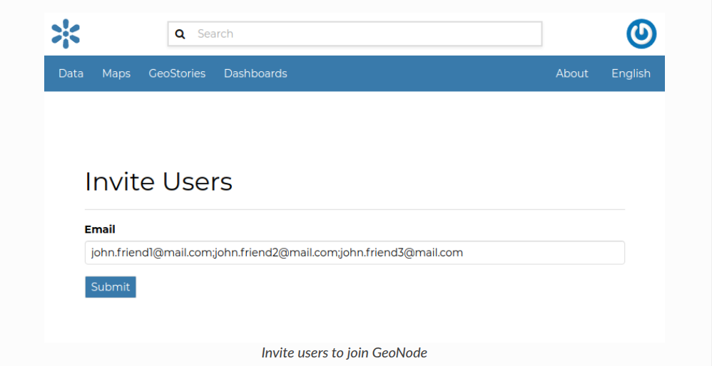
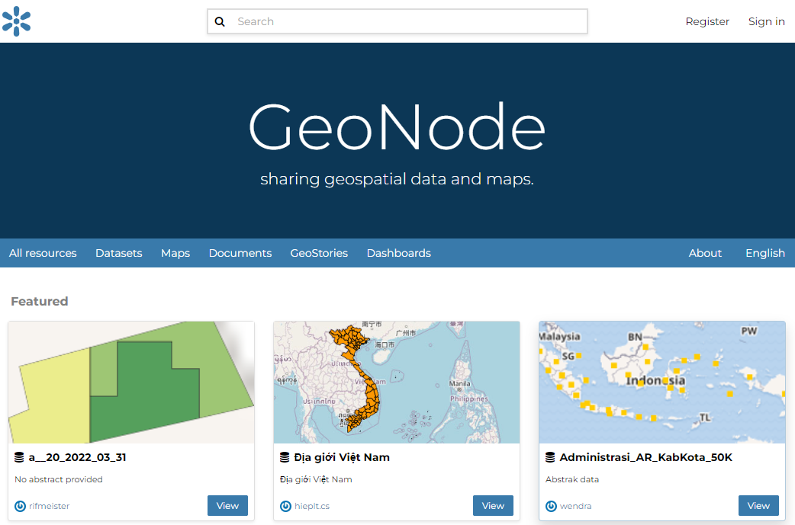
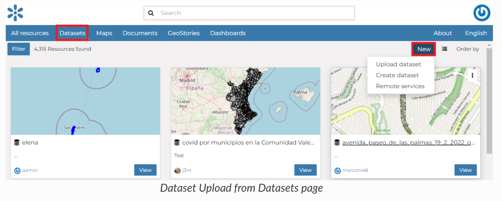

# Geonode Guide

Creating a New Account
======================

To take full advantage of all the GeoNode features you need a user account. Follow these step to create a new one.

* From any page in the web interface, you will see a `Register` link. Click that link, and the register form will appear

    > Note: The registrations in GeoNode must be open, in case you don't see the register link then it's not possible to register unless the administrator of the site does that for you.

    

* On the next page, fill out the form. Enter a username and password in the fields. Also, enter your email address for verification.

  
  
* You will be automatically logged in and redirected to the Profile page. An email will be sent confirming that you have signed up. If no errors occur during the registration, the following alerts will appear on the screen:

    

* To log out click on the `Log out` link of the user menu.

  

* You have to confirm this action as described in the picture below.

  

Updating the Profile
=====================

Once having an account you can enrich your profile with useful information, you can also edit or delete the existing ones.
You can connect the account with your social network, associate many e-mail addresses to it and manage many options such as preferences about notifications.

You can update these information anytime from your *Profile* page which is accessible from the user menu.

So, click on your profile picture in the top right of the screen. A drop-down list will show. Click on `Profile` to enter the *Profile* settings page.

The *Profile* page looks like the one shown in the picture below.

Your personal information is shown under the username. At the bottom of the page are listed all the resources associated to your *Profile*, you can decide to view only datasets, maps ,documents, dashboard or geostory by clicking on the corresponding tab.

Through the link ``User datasets WMS GetCapabilities document`` you can retrieve an XML document with the list of the available datasets.

On the right side of the page there are many useful links to edit personal information to update your *Profile* settings and to get in touch with other GeoNode users.

The `My Activities` link allows to see all your recent activities on GeoNode such as datasets uploading and maps creation.

All other links and their functionalities will be described in depth in the following sections.

Editing Profile Information
===========================

Your *Profile* contains personal information such as your address, your telephone number, your organization and so on but it is empty by default at the beginning.

Through the `Edit profile` button of the *Profile* page (see :ref:`editing-profile`) you can set your details, including your avatar.

| When finished, click `Update profile`. You will be redirected to the *Profile* page.
| A message will confirm the profile has been correctly updated.

Interacting with Users and Groups
=================================

The GeoNode platform allows you to communicate by message with other GeoNode users and groups of users.

| You can also invite external users to join your GeoNode. In order to do that, click on `Invite Users` in the *Profile* page (see :ref:`editing-profile`) or in the `About` menu in the *Home* page.
| You can invite your contacts typing their email addresses in the input field as shown in the picture below. Click on `Submit` to perform the action.

A message will confirm that invitations have been correctly sent.

Data Types
==========

| GeoNode welcome page shows a variety of information about the current GeoNode instance.
| You can explore the existing data using many search tools and filters (see [`finding-data`](https://docs.geonode.org/en/master/usage/data/finding_data.html#finding-data)) or through the links of the navigation bar at the top of the page.
| There are five main types of resources that GeoNode can manage:

1. Datasets
2. Maps
3. Documents
4. GeoStories
5. Dashboards

Each resource type has its own menu and can be reached `Datasets`, `Maps`, `Documents`, `GeoStories` and `Dashboards` buttons on the navigation bar

>Note: `GeoStories` and `Dashboards` In the screenshot below are GeoApp resouce types which are added by the client.

Datasets
------

| Datasets are a primary component of GeoNode.
| Datasets are publishable resources representing a raster or vector spatial data source. Datasets also can be associated with metadata, ratings, and comments.

| By clicking the Datasets link you will get a list of all published datasets. If logged in as an administrator, you will also see the unpublished datasets in the same list.
| GeoNode allows the user to upload vector and raster data in their original projections using a web form.

Vector data can be uploaded in many different formats (ESRI Shapefile, KML and so on...). Satellite imagery and other kinds of raster data can be uploaded as GeoTIFFs.

Maps
----

| Maps are a primary component of GeoNode.
| Maps are comprised of various datasets and their styles. Datasets can be both local datasets in GeoNode as well as remote datasets either served from other WMS servers or by web service datasets such as Google or MapQuest.
GeoNode maps also contain other information such as map zoom and extent, dataset ordering, and style.

You can create a map based on uploaded datasets, combine them with some existing datasets and a remote web service dataset, share the resulting map for public viewing.
Once the data has been uploaded, GeoNode lets the user search for it geographically or via keywords and create maps.
All the datasets are automatically reprojected to web mercator for maps display, making it possible to use popular base maps such as [OpenStreetMap](https://www.openstreetmap.org).

Documents
---------

* GeoNode allows to publish tabular and text data and to manage metadata and associated documents.
* Documents can be uploaded directly from your disk (see [uploading-documents](https://docs.geonode.org/en/master/usage/managing_documents/uploading_documents.html#uploading-documents) for further information).
* The following documents types are allowed: `txt, .log, .doc, .docx, .ods, .odt, .sld, .qml, .xls, .xlsx, .xml, .bm, .bmp, .dwg, .dxf, .fif, .gif, .jpg, .jpe, .jpeg, .png, .tif, .tiff, .pbm, .odp, .ppt, .pptx, .pdf, .tar, .tgz, .rar, .gz, .7z, .zip, .aif, .aifc, .aiff, .au, .mp3, .mpga, .wav, .afl, .avi, .avs, .fli, .mp2, .mp4, .mpg, .ogg, .webm, .3gp, .flv, .vdo, .glb, .pcd, .gltf`.
* Through the document detailed page is possible to view, download and manage a document.

GeoStories
---------

* GeoStory is a MapStore tool integrated in GeoNode that provides the user a way to create inspiring and immersive stories by combining text, interactive maps, and other multimedia content like images and video or other third party contents. Through this tool you can simply tell your stories on the web and then publish and share them with different groups of GeoNode users or make them public to everyone around the world.

Dashboard
---------

* Dashboard is a MapStore tool integrated in GeoNode that provides the user with a space to add many Widgets, such as charts, maps, tables, texts and counters, and can create connections between them in order to:
  - Provide an overview to better visualize a specific data context
  - Interact spatially and analytically with the data by creating connections between widgets
  - Perform analysis on involved data/layers

Finding Data
============

* This section will guide you to navigate GeoNode to find datasets, maps and documents and other resource types by using different routes, filters and search functions.
* On every page you can find some quick search tool.

The **Search** box in the navigation bar (see the picture below) let you type a text and find all the resource which have to deal with that text.

When you trigger a search you are brought to the *Search* page which shows you the search result through all data types.

* This page contains a wealth of options for customizing a search for various information on GeoNode. This search form allows for much more fine-tuned searches than the simple search box is available at the top of every page.
* It is possible to search and filter data by Text, Types, Categories, Keywords, Owners, Regions, Group, Limitations on public access, Date and Extent.

Try to set some filter and see how the resulting data list changes accordingly. An interesting type of filter is *EXTENT*: you can apply a spatial filter by moving or zooming a map within a box as shown in the picture below.

Data can be ordered by Most recent, Less recent, Name and Popularity.

Upload/Add Documents
===================

GeoNode allows to share reports, conceptual notes, posters, spreadsheets, etc. A wide range of documents files can be hosted on the platform, including text files (.doc, .docx, .txt, .odt), spreadsheets (.xls, .xlsx, .ods), presentations (.ppt, .pptx, .odp), images (.gif, .jpg, .png, .tif, .tiff), PDF, zip files (.rar, .zip, .gz), SLD, XML, QML files or as External URL.

> Warning:: Only authenticated users can upload data into GeoNode.

It is possible to upload a *Documents* in two ways:

- From the `All Resources` page, by clicking *Add Resource* which displays a list including `Upload document` link:

  

- From the `Documents` page, by clicking on *New* button.

  

The *Document Upload* page looks like the one shown in the picture below.

On *GeoNode* documents can be:

* Upload from the **Local file**

* Created with reference to **External URL** 

In order to upload a document from the **Local file**, you need to:

1. Click on `Select files` button
2. Select a file from your disk.
3. Click the `Upload` button

    []

* A document may refer to a remote document, without making a local copy of the remote resource.
* To add a document that references an **External URL** you need to:

1. Click on `Add URL` button
2. Select an URL
3. Select an extension from the drop-down menu 
4. Click the `Upload` button

    

At the end of the uploading process, by clicking on the View button, you will be driven to the document page with the Info panel open. Here it is possible to view more info, edit metadata, share, download, and delete the document. See the next section to know more about Metatadata.

> Note:: If you get the following error message:

Total upload size exceeds 100.0 MB. Please try again with smaller files.
     
This means that there is an upload size limit of 100 MB. An user with administrative access can change the upload limits at the [admin panel](https://docs.geonode.org/en/master/admin/upload-size-limits/index.html#upload-size-limits).

Share Options
===================================================

GeoNode encourages to publicly, share and make available for download information uploaded on the platform. By default, anyone can see and download a document. However, the document responsible can choose to limit access to the document to some contributors and/or groups.

Through the *Share* Link shown in the menu it is possible to manage the document share options. it opens a form where set up who can:

* None (the document is not visible).
* View Metadata  (allows to view the document).
* View and Download (allows to view and download the document).
* Edit (allows to change the document metadata and attributes).
* Manage it (allows to update, delete, change share options, publish/unpublish).

    

See an example in the picture below.

> Note:: After making changes, always save them with the *Save* Link in the menu

Usually those with options of editing metadata and the management of a document are in charge and responsible of the document, i.e. the contributor who uploaded it has those options by default.

Once the share options are set, click `Save` link in the menu to save them.

Datasets Uploading
================

* The most important resource type in GeoNode is the *Dataset*. A dataset represents spatial information so it can be displayed inside a map.
* To better understand what we are talking about lets upload your first dataset.

It is possible to upload a *Datasets* in two ways:

- From the `All Resources` page, by clicking *Add Resource* which displays a list including `Upload dataset` link:

  

- From the `Datasets` page, by clicking on *New* which displays a list including `Upload dataset` link:

  

The *Datasets Uploading* page looks like the one in the picture below.

  

| Through the `Select files` button you can select files from your disk, make sure they are valid raster or vector spatial data, then you can click to `Upload` button. 
A progress bar shows the operation made during the dataset upload and alerts you when the process is over.

  

In this example the ``ne_10m_airports2`` ESRI Shapefile, with all its mandatory files (`.shp`, `.shx`, `.dbf` and `.prj`), has been chosen.
When the process ends click on `View` button

  

.. note:: There are lot of free spatial dataset available in the Internet. In this example, an extract of the Berlin city center roads map from the [BBBike extracts OpenStreetMap](https://extract.bbbike.org) dataset has been used.

In the next paragraphs you will learn how to create a dataset from scratch, how to set share options, how to explore the dataset properties and how to edit them.

>Note:: If you get the following error message:

Total upload size exceeds 100.0 MB. Please try again with smaller files.``
     
This means that there is an upload size limit of 100 MB. An user with administrative access can change the upload size limits at the [admin panel for size limits](https://docs.geonode.org/en/master/admin/upload-size-limits/index.html#upload-size-limits).

Similarly, for the following error message:

The number of active parallel uploads exceeds 5. Wait for the pending ones to finish.

You can modify the upload parallelism limits at the [admin panel for parallelism limits](https://docs.geonode.org/en/master/admin/upload-parallelism-limit/index.html#upload-parallelism-limits).

Creating Maps
=============

In this section, we’ll create a *Map* using some uploaded datasets, combine them with some other datasets from remote web services, and then share the resulting map for public viewing.

In order to create new maps you can use:

* The `Create map` listed after clicking the `Add Resource` button on the *All Resources* list page.

  

- The `New` button after clicking the `Maps` button on the menu bar.

* The `Create map` link in the *Dataset Page* (it creates a map using a specific dataset)

  

* The new *Map* will open in a *Map Viewer* like the one in the picture below.

  

Publishing Data
===============

In GeoNode, each resource can be published in order to share it with other people.

In order to publish a map, document or dataset or any other Geonode resource, Go to the settings tab in the Metadata Edit form, The check for publishing and unpublishing is available.
See picture below.

Click `Update` to save the changes.

## Reference

You can click [here](https://docs.geonode.org/en/master/index.html) for the official GeoNode documentation.
