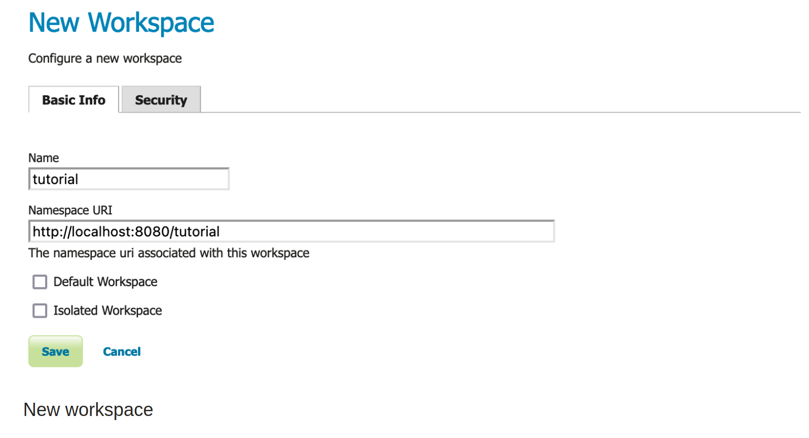
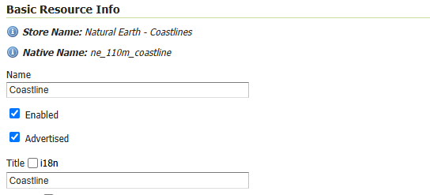
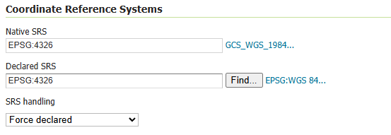
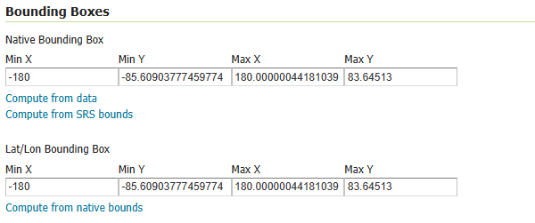
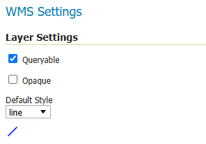
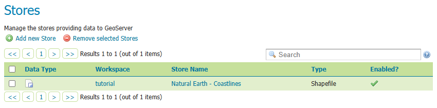
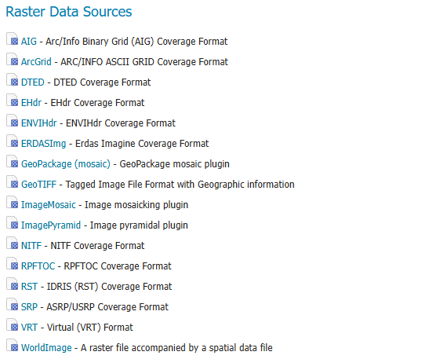
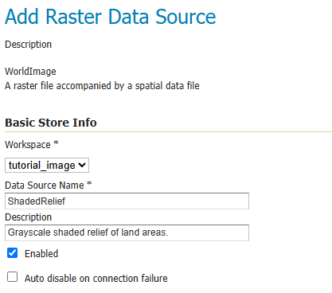

# GeoServer Guide

## Getting Started

## Using the web administration interface

GeoServer includes a browser-based web administration interface that allows users to configure all aspects of the server—from adding and publishing data to adjusting service settings.

<br>

This interface is accessed through a web browser at:

   ```
   http://<host>:<port>/geoserver
   ```

For a default installation, the address is typically:

   ```
   http://localhost:8080/geoserver
   ```

<br>

When opened, the application displays the Welcome page containing links to the various web services used to access your spatial data. These links can be copied and pasted into Desktop GIS software, mobile apps, or web mapping applications to utilize the services provided.


<br>

> **Note:** For more information, see the [Welcome](https://docs.geoserver.org/latest/en/user/webadmin/welcome.html#welcome) section in the GeoServer documentation.

## Logging In

To change server settings or configure data in GeoServer, the user must first be authenticated.

<br>

To log in:

1. Navigate to the upper-right corner of the web interface.
2. Enter the default administrator credentials, which are:

    - **User name:** `admin`
    - **Password:** `geoserver`


<br>

Once logged in, the Welcome screen updates to display administrative functions, which are primarily accessed through the menus on the left side of the interface.


## Layer Preview

The [Layer Preview](https://docs.geoserver.org/latest/en/user/data/webadmin/layerpreview.html#layerpreview) page provides a quick way to view the output of published layers.

1. Click the **Layer Preview** link in the menu to access this page.
   
    
   
    <br>

2. Locate the layer you want to preview and click a link under the desired output format. For example,  clicking the **OpenLayers** link will display a preview of that layer.
   
    <br>

3. To sort any column alphabetically, simply click on the column header.
   
    

    <br>

4. Use the search box to filter the list of items — especially helpful when working with data types that include many layers. Enter your search term and press **Enter**. GeoServer will display a filtered list of items matching your query.

    

    <br>

> **Hint** For an exact match, enclose your search term in quotes or double quotes. For instance, `ads` would match `roads`, but `"ads"` would only match the exact term.

> **Note** Sorting and searching functions are available on all data configuration pages..

> **Note** For additional details, see the full [Layer Preview documentation](https://docs.geoserver.org/latest/en/user/data/webadmin/layerpreview.html#layerpreview).

<br>

# Publishing a GeoPackage

This tutorial guides you through the steps to publish a GeoPackage using GeoServer.

> **Note** This tutorial assumes GeoServer is running at `http://localhost:8080/geoserver`.

## Data Preparation

Let’s start by preparing the data for publishing.

The sample data folder includes the file: `data/ne/natural_earth.gpkg`. This GeoPackage contains small-scale 1:110m datasets, including:

- [Coastlines](https://www.naturalearthdata.com/downloads/110m-physical-vectors/110m-coastline/)
- [Countries](https://www.naturalearthdata.com/downloads/110m-cultural-vectors/110m-admin-0-countries/)
- [Boundary lines](https://www.naturalearthdata.com/downloads/110m-cultural-vectors/110m-admin-0-boundary-lines/)
- [Populated places](https://www.naturalearthdata.com/downloads/110m-cultural-vectors/110m-populated-places/)

<br>

> **Note** The file `data/ne/natural_earth.gpkg` is a processed version of the dataset from [Natural Earth Data](https://www.naturalearthdata.com/downloads/). To obtain the original version, visit the site and download it directly from this [GeoPackage link](https://naciscdn.org/naturalearth/packages/natural_earth_vector.gpkg.zip).

## Creating a New Workspace

The next step is to create a workspace for the GeoPackage. A workspace is essentially a folder used to organize and group related layers.

> **Note** This step is optional if you prefer to use an existing workspace. Typically, a new workspace is created for each project, allowing you to group related stores and layers together.

<br>

1. Open a web browser and go to `http://localhost:8080/geoserver`.
2. Log in to GeoServer as outlined in the [Logging In](https://docs.geoserver.org/latest/en/user/gettingstarted/web-admin-quickstart/index.html#logging-in) section.
3. Navigate to **Data → Workspaces**.

    

4. Click the **Add new workspace** button to open the **New Workspace** page.
5. Fill in the following fields:

    | Field           | Value                                      |
    |---------------|----------------------------------|
    | Name          | `tutorial`                                |
    | Namespace URI | `http://localhost:8080/geoserver/tutorial` |

    > **Note** The workspace name should describe your project. It must be 10 characters or fewer and cannot contain spaces.

    > **Note** The Namespace URI can be any URL-like string tied to your project. It typically includes a trailing identifier that reflects the workspace. This URI does not need to resolve to a real web address.

    <br>

6. Click the **Submit** button.

    

7. The `tutorial` workspace should now appear in the **Workspaces** list.

## Create a Store

Once the workspace is set up, the next step is to add a new store. A store tells GeoServer how to connect to the GeoPackage.

1. Navigate to **Data → Stores**.

    [](./img/geoserver-img-9.png)

2. To add the GeoPackage, click the **Add new Store** button. This will take you to a list of data sources supported by GeoServer.

    > **Note** Keep in mind that this list is extensible, so yours might look slightly different.

    [](./img/geoserver-img-10.png)

3. From the list of **Vector Data Sources**, find and click the **GeoPackage** option.
4. Fill in the following fields:

    | Field               | Value                      |
    |--------------------|--------------------------|
    | Workspace         | `tutorial`                |
    | Data Source Name  | `NaturalEarth`            |
    | Description       | `GeoPackage of NaturalEarth data` |

    

5. Under **Connection Parameters**, enter the following:
    - **Database**: `file:data/ne/natural_earth.gpkg`
    - **Read only**: checked

    > **Note** The use of read_only above indicates that we will not be writing to this GeoPackage, allowing GeoServer to avoid managing write locks when accessing this content for greater performance.

      [](./img/geoserver-img-12.png)

6. Press **Save**. You will be redirected to the **New Layer** page.

## Creating a Layer

Now that we have connected to the GeoPackage, we can publish the layer.

1. On the New Layer page, click Publish beside the countries `layer name`.

    [](./img/geoserver-img-13.png)

2. The Edit Layer page defines the data and publishing parameters for a layer.

    [](./img/geoserver-img-14.png)

3. There are three critical pieces of information required on the Data tab before we can even save.

  - **Basic Resource Info** - describes how the layer is presented to others

  - **Coordinate Reference System** - establishes how the spatial data is to be interpreted or drawn on the world

  - **Bounding Boxes** - establishes where the dataset is located in the world

4. Locate Basic Resource Info and define the layer:

    | Field | Value|
    |-----------|------------|
    | Name  | `Countries`|
    | Title | `Countries`|
    | Abstract | `Sovereign states`|

* The naming of a layer is important, and while GeoServer does not offer restrictions many of the individual protocols will only work with very simple names.

  

5. Double check the Coordinate Reference Systems information is correct.

| Field | Value|
|----------------|----------|
|Native SRS| EPSG:4326|
|Declaired SRS | EPSG:4326|
| SRS Handling | Force declared|

  

6. Locate Bounding Boxes and generate the layer’s bounding boxes by clicking the Compute from data and then Compute from native bounds links.

  

7. Press Apply to save your work thus far without closing the page.

  - This is a good way to check that your information has been entered correctly, GeoServer will provide a warning if any required information is incomplete.

8. Scroll to the top of the page and navigate to the Publishing tab.

9. Locate the WMS Settings heading, where we can set the style.Ensure that the Default Style is set to polygon`.

  

10. Press Save to complete your layer edits.

## Previewing the layer¶

In order to verify that the `tutorial:countries` layer is published correctly, we can preview the layer.

1. Navigate to the Data > Layer Preview page and find the tutorial:countries layer.

> Note: Use the Search field with tutorial as shown to limit the number of layers to page through.

  

2. Click the OpenLayers link in the Common Formats column.

3. An OpenLayers map will load in a new tab and display the shapefile data with the default line style.

You can use this preview map to zoom and pan around the dataset, as well as display the attributes of features.

  

# Publishing an Image

This tutorial walks through the steps of publishing a World + Image with GeoServer.

> **Note:** This tutorial assumes that GeoServer is running at `http://localhost:8080/geoserver`.

## Data Preparation

First, let us gather the data that we will be publishing.

1. Download the Natural Earth 1:50m Shaded Relief raster:
   - [https://www.naturalearthdata.com/downloads/50m-raster-data/50m-shaded-relief/](https://www.naturalearthdata.com/downloads/50m-raster-data/50m-shaded-relief/)

2. This file contains small-scale 1:50m data:
   - `SR_50M.prj`
   - `SR_50M.README.html`
   - `SR_50M.tfw`
   - `SR_50M.tif`
   - `SR_50M.VERSION.txt`

   This forms a world (`tfw` file) plus image (`tif` file).

3. Move these files into your GeoServer Data Directory `data/ne` folder.

## Creating a New Workspace

The next step is to create a workspace for the data. A workspace is a folder used to group similar layers together.

> **Note:** This step is optional if you’d like to use an existing workspace. Usually, a workspace is created for each project, which can include stores and layers that are related to each other.

1. In a web browser, navigate to `http://localhost:8080/geoserver`.
2. Log into GeoServer.
3. Navigate to **Data > Workspaces**.
4. Click **Add new workspace** to display the **New Workspace** page.
5. Enter the following details:
   - **Name:** `tutorial`
   - **Namespace URI:** `http://localhost:8080/geoserver/tutorial`

   > **Note:** A workspace name is an identifier describing your project. It must not exceed ten characters or contain spaces.
   >
   > **Note:** A Namespace URI (Uniform Resource Identifier) can usually be a URL associated with your project with an added trailing identifier indicating the workspace. It does not need to resolve to a valid web address.

6. Press **Submit**.
7. The `tutorial` workspace will be added to the **Workspaces** list.

## Creating a Store

Once the workspace is created, we are ready to add a new store. The store tells GeoServer how to connect to the image.

1. Navigate to Data‣Stores.
2. This page displays a list of stores, including the type of store and the workspace that the store belongs to.
3. In order to add the geopackage, you need to create a new store. Click the Add new Store button. You will be redirected to a list of data sources supported by GeoServer. Note that data sources are extensible, so your list may look slightly different.
4. From the list of Raster Data Sources locate and click the WorldImage link.

  

5. The New Vector Data Source page will display.

6. Begin by configuring the Basic Store Info.

| workspace | tutorial|
|-----------|-----------|
|Data Source Name| ShadedRelief|
| Description | Grayscale shaded relief of land areas. |

  - This information is internal to GeoServer and is not used as part of the web service protocols. We recommend keeping the Data Source Name simple as it will be used to form folders in the data directory (so keep any operating system restrictions on character use in mind).

  

7. Connection parameters are used to establish the location of your data.

8. Under Connection Parameters, browse to the location URL of the image, in our example file:data/ne/SR_50M.tif.

9. The Connection Parameters for our geopackage are:

  database : `file:data/ne/SR_50M.tif`

10. Press `save`.

## Creating a Layer

Now that we have located the image, we can publish it as a layer.

1. On the New Layer page, click Publish beside the SR_50M layer name.

2. The Edit Layer page defines the data and publishing parameters for a layer.

3. There are three critical pieces of information required on the Data tab before we can even save.

  - Basic Resource Info - describes how the layer is presented to others

  - Coordinate Reference System - establishes how the spatial data is to be interpreted or drawn on the world

  - Bounding Boxes - establishes where the dataset is located in the world

4. Locate Basic Resource Info and define the layer:

| Name|shaded|
|---------|---------|
|Title|Shaded Relief|
|Abstract|Grayscale shaded relief of land areas.|

- The naming of a layer is important, and while GeoServer does not offer restrictions many of the individual protocols will only work with very simple names.

    

5. Check the Coordinate Reference Systems information.

6. Locate Bounding Boxes and generate the layer’s bounding boxes by clicking the Compute from SRS bounds and then Compute from native bounds links.

    

7. Press Apply to save your work thus far without closing the page.

8. This is a good way to check that your information has been entered correctly, GeoServer will provide a warning if any required information is incomplete.

9. Scroll to the top of the page and navigate to the Publishing tab.

    

10. Locate the WMS Settings heading, where we can set the style. Ensure that the Default Style is set to raster.

# Publishing a Layer Group

> **Note:** This tutorial assumes that GeoServer is running at `http://localhost:8080/geoserver`.

## Data preparation

First let us gather the data that we will be publishing.

1. Complete the previous tutorials:
   - [Publishing a GeoPackage](https://docs.geoserver.org/latest/en/user/gettingstarted/geopkg-quickstart/index.html#geopkg-quickstart) defining the `tutorial:countries` layer
   - [Publishing an Image](https://docs.geoserver.org/latest/en/user/gettingstarted/image-quickstart/index.html#image-quickstart) defining the `tutorial:shaded` layer

## Create a layer group

1. Navigate to **Data > Layer Group** page.
   
   
   
2. This page displays a list of layer groups and the workspace the group belongs to.
   
   > **Note:** Layer groups can be “global”, allowing a map to be created combining layers from several workspaces into a single visual.

3. At the top of the **Layer Groups** list, click **Add new layer group**.

4. The **Layer group** editor defines:
   - **Basic Resource Info** - describes how the layer is presented to others
   - **Coordinate Reference System** - establishes how the spatial data is to be interpreted or drawn on the world
   - **Bounding Boxes** - establishes where the dataset is located in the world
   - **Layers** - the layers to be drawn (listed in draw order)

5. Locate **Basic Resource Info** and define the layer:

   | Name    | `basemap` |
   |---------|-----------|
   | Title   | `Basemap` |
   | Abstract | `Plain basemap suitable as a backdrop for geospatial data.` |
   | Workspace | `tutorial` |
   
   

6. Scroll down to the **Layers** list, which is presently empty.

7. Click **Add Layer**, select the `tutorial:shaded` layer first.
   
   - The raster should be drawn first, as other content will be shown over top of it.

8. Click **Add Layer**, select the `tutorial:countries` layer second.
   
   - This polygon layer will be drawn second.

9. Locate the `tutorial:countries` layer in the list and click the **Style** entry to change `polygon` to `line`.
   
   - By drawing only the outline of the countries, the shaded relief can show through.

   

10. Locate **Coordinate Reference Systems** and press **Generate Bounds**.
    
    - Now that layers are listed, they can be used to determine the coordinate reference system and bounds of the layer group.
    
    

11. Press **Save** to complete your layer group.

# Publishing a style

This tutorial walks through the steps of defining a style and associating it with a layer for use.

> **Note** This tutorial assumes that GeoServer is running at `http://localhost:8080/geoserver`.

## Create a style

1. Navigate to **Data > Style** page.

   

2. This page displays a list of styles, including the workspace the style belongs to.

   > **Note**  
   > Styles groups are allowed to be "global," allowing a style to be defined and used by any layer.

3. At the top of the **Styles** list, locate and click the **Add a new style** link.

4. Locate **Style Data** and define the style:

   | Name       | Value          |
   |------------|---------------|
   | Name       | `background`   |
   | Workspace  | `tutorial`     |
   | Format     | `SLD`          |

   

5. Locate **Style Content** and configure:
   - Under **Generate a default style**, select `Polygon`.
   

6. Click the **Generate** link to populate the style editor with a generated outline of a polygon style.
   

7. Press the **Apply** button to define this style.
   - Now that the style is defined, there are more options for interactively working with the style.

8. Change to the **Publishing** tab.
   - Use the search to filter with `tutorial` to locate `tutorial:countries`.
   - Check the **Default** checkbox for `tutorial:countries` to use the `tutorial:background` style as the default for this layer.
   

9. Navigate to the **Layer Preview** tab.
   - Locate **Preview on layer** and click on the link to select `tutorial:countries` as a dataset to use when editing the style.
   

10. Edit your style by inserting `fill-opacity` value of `0.25`.

```xml
<?xml version="1.0" encoding="ISO-8859-1"?>
<StyledLayerDescriptor version="1.0.0"
  xsi:schemaLocation="http://www.opengis.net/sld http://schemas.opengis.net/sld/1.0.0/StyledLayerDescriptor.xsd"
  xmlns="http://www.opengis.net/sld" xmlns:ogc="http://www.opengis.net/ogc"
  xmlns:xlink="http://www.w3.org/1999/xlink" xmlns:xsi="http://www.w3.org/2001/XMLSchema-instance">

  <NamedLayer>
    <Name>background</Name>
    <UserStyle>
      <Title>Background</Title>
      <FeatureTypeStyle>
        <Rule>
          <Title>Background</Title>
          <PolygonSymbolizer>
            <Fill>
              <CssParameter name="fill">#444433</CssParameter>
              <CssParameter name="fill-opacity">0.25</CssParameter>
            </Fill>
            <Stroke>
              <CssParameter name="stroke">#000000</CssParameter>
              <CssParameter name="stroke-width">0.25</CssParameter>
            </Stroke>
          </PolygonSymbolizer>
        </Rule>
      </FeatureTypeStyle>
    </UserStyle>
  </NamedLayer>
</StyledLayerDescriptor>
```

11. Press Apply to edit your style and check the resulting visual change in the layer preview.

* For more information you can go with [Official docs](https://docs.geoserver.org/latest/en/user/)
