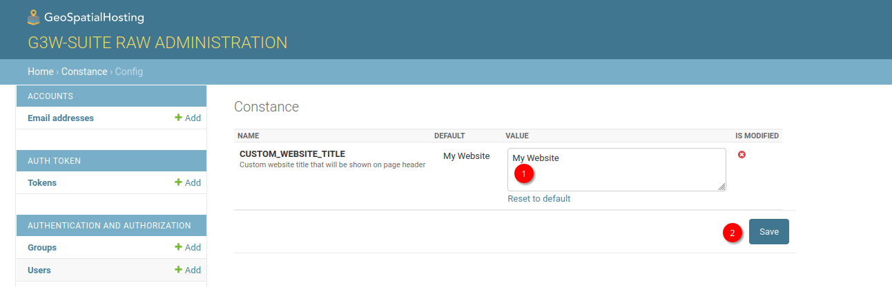
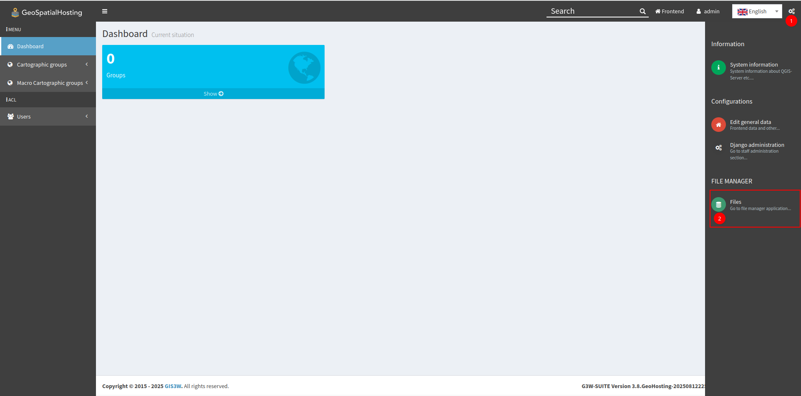

# Customising G3W

## Login as admin
Go to your G3W instance, click Admin

Enter username and password

Go to admin

## Update Site Title
(1) Click Gear icon on the top right page
(2) Click Django administration

(1) On Admin page, click Config

Update website title (1) and (2) save

Website title on the browser tab will be changed when reloaded, from

to

## Update Landing Page Background
(1) Click Gear icon on the top right page
(2) Click Files

Go to custom_static folder

Go to custom_static/images/home

(1) images.json contains the detail of the background image e.g. author and author URL.
(2) image to be used as background.

If images.json is not provided, it will use any image (and select the first image) in the directory as background image.

Example of updated images (updated to white image)

## Update logo
(1) Click Gear icon on the top right page
(2) Click Files

Replace these files with your desired logo. 
Follow the dimension of the files to ensure nice fit on the website UI.
Uploaded files must follow the exact same name.

(1) favicon.ico will be shown as favicon on the browser tab.

(2) logo_main.png will be used when left sidebar on the admin page is expanded.

(3) logo_main.png will be used when left sidebar on the admin page is collapsed.

(4) logo_login.png will be used when you login to the admin page directly e.g. from
https://your-g3w.geospatialhosting.com/en/login/?next=/en/admin/, instead of using landing page.

## Customise Website Style and Colors

(1) Click Gear icon on the top right page
(2) Click Files

Go to custom_static/css.

Here, you will see 2 files: (1) custom.css and (2) style.css

You can edit custom.css and upload it (3).

If you need original version of those files, you can go to:
https://github.com/kartoza/g3w-admin/tree/GeoHosting/g3w-admin/core/static/custom_static/css